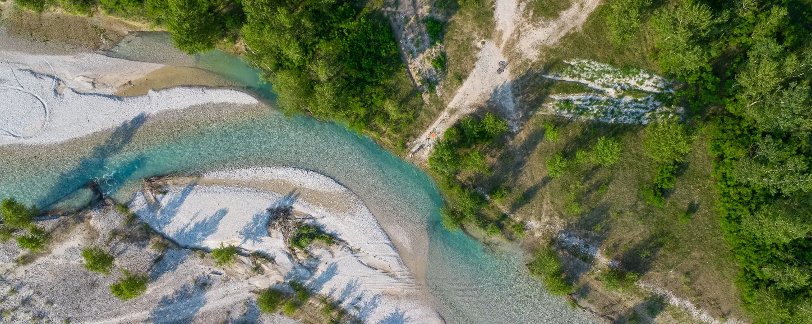

# Hi, I'm John

  

## About me

- Currently studying for Bachelor's degree in Computer Science at [University of Udine](https://www.uniud.it)

- I'm a member and sometimes ctf player of [MadrHacks](https://www.madrhacks.org/)

 

## Stats

