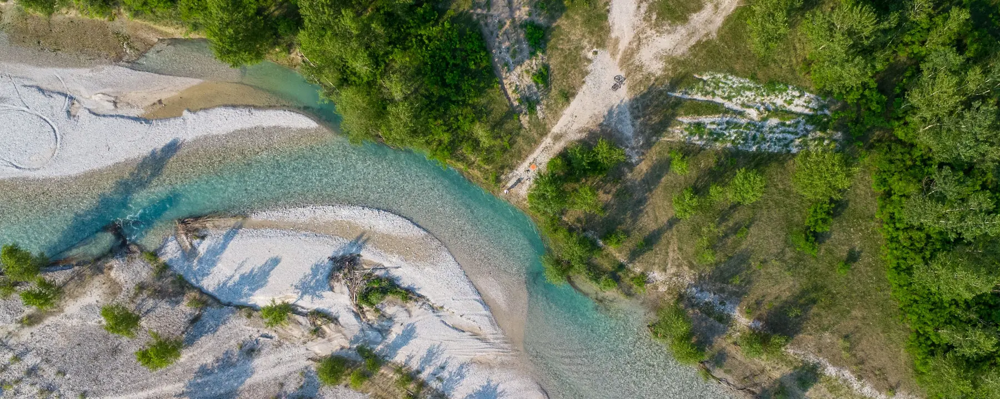

# Hi, I'm John

  

## About me

- Currently studying for Bachelor's degree in Computer Science at [University of Udine](https://www.uniud.it)
- I'm a member and sometimes ctf player of [MadrHacks](https://www.madrhacks.org/)
- I am really interested in microservices and backend in general
- I have a passion for drones and hope someday to be able to build one by myself
- I was a SWE Intern at Uber

## Socials

- [LinkedIn](https://www.linkedin.com/in/john-toniutti)
- [GitHub](https://github.com/jotonedev)
- [Blog](https://jotone.it)
